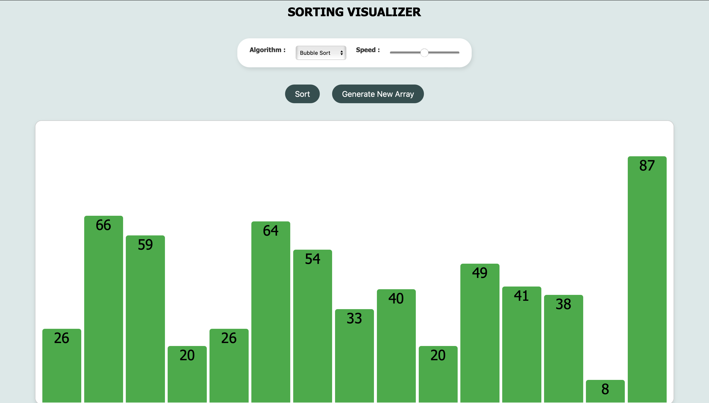
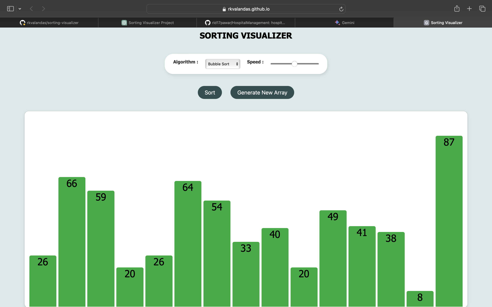
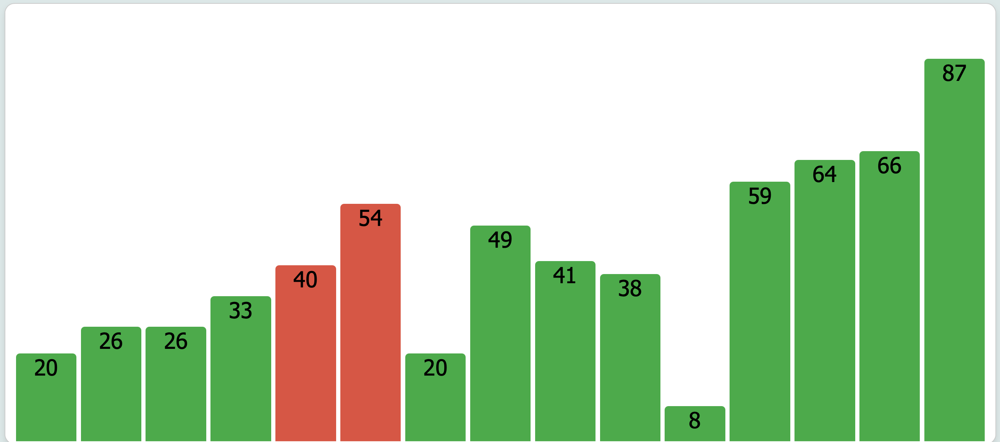

# Sorting Visualizer

A web application to visualize various sorting algorithms in real-time. This project demonstrates the inner workings of sorting algorithms such as Bubble Sort, Merge Sort, Quick Sort, and Insertion Sort with animated visual feedback.

## Features

- **Algorithm Selection**: Choose from Bubble Sort, Merge Sort, Quick Sort, and Insertion Sort.
- **Speed Adjustment**: Control the speed of the sorting animations.
- **Custom Array Input**: Generate a new array of random numbers.
- **Real-Time Visualization**: Watch the sorting process step-by-step with smooth animations.
- **Height Display**: See the value of each bar represented visually and as a number.

## Technologies Used

- **HTML**: Structure of the web application.
- **CSS**: Styling for aesthetic and responsive design.
- **JavaScript**: Logic for sorting algorithms and dynamic DOM manipulation.

## Getting Started

Follow these instructions to get a copy of the project up and running on your local machine.

### Prerequisites

You need a web browser to run this project.

### Installation

1. **Clone the repository**:
   ```sh
   git clone https://github.com/rkvalandas/sorting-visualizer.git
2. **Navigate to the project directory**:
   ```sh
    cd sorting-visualizer
3. **Open index.html in your browser:**:
Open index.html in your browser:
You can open the file directly by navigating to the project directory and double-clicking on index.html.
## Usage

***Generate Array:*** Click the "Generate New Array" button to create a new array of random numbers.
***Select Algorithm:*** Choose the desired sorting algorithm from the dropdown menu.
***Adjust Speed:*** Use the speed slider to control the sorting animation speed.
***Start Sorting:*** Click the "Sort" button to begin the sorting process. Watch the bars move and sort in real-time with their heights displayed.
## Screenshots




## Contributing

Contributions are welcome! Please open an issue or submit a pull request for any improvements or bug fixes.

1. **Fork the repository.**
2. **Create your feature branch:**
    ```sh
    git checkout -b feature/your-feature-name
3. **Commit your changes:**
    ```sh
    git commit -m 'Add some feature'
4. **Push to the branch:**
    ```sh
    git push origin feature/your-feature-name
5. **Open a pull request.**
## License

This project is licensed under the MIT License - see the LICENSE file for details.

## Acknowledgements

- Inspired by various sorting visualizer projects available online.
- Thanks to the open-source community for providing tools and resources.
## Contact

If you have any questions or suggestions, feel free to reach out.

- ***Your Name:*** valandasuramakrishna@gmail.com
- ***GitHub:*** rkvalandas